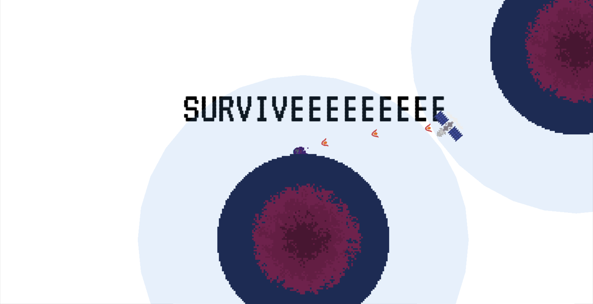

# Tour De Space

A bullet hell game designed on top of Godot Engine. The game is inspired by Touhou Project and is a tribute to the series. The game is still in development and is not yet complete. The game is currently in not in a playable state as an exe but can be run using godot engine.

## Controls

-   Arrow Keys: Move
-   LMB: Shoot
-   Shift: Focus
-   Space: Bomb (In development)
-   Esc: Pause

## Features

-   1 playable characters
-   1 playable stages
-   0 playable bosses
-   0 playable endings
-   1 playable difficulties
-   0 playable music tracks
-   0 playable soundtracks
-   0 playable sound effects
-   0 playable backgrounds
-   1 playable bullet patterns
-   1 playable bullet colors

## Credits

-   [Godot Engine](https://godotengine.org/)
-   [Touhou Project](https://en.wikipedia.org/wiki/Touhou_Project)
-   [Touhou Wiki](https://en.touhouwiki.net/wiki/Main_Page)

## License

[MIT](https://choosealicense.com/licenses/mit/)

## Contributing

Pull requests are welcome. For major changes, please open an issue first to discuss what you would like to change.

Please make sure to update tests as appropriate.

## Authors and acknowledgment

-   [KunalKatiyar](https://www.github.com/KunalKatiyar)
